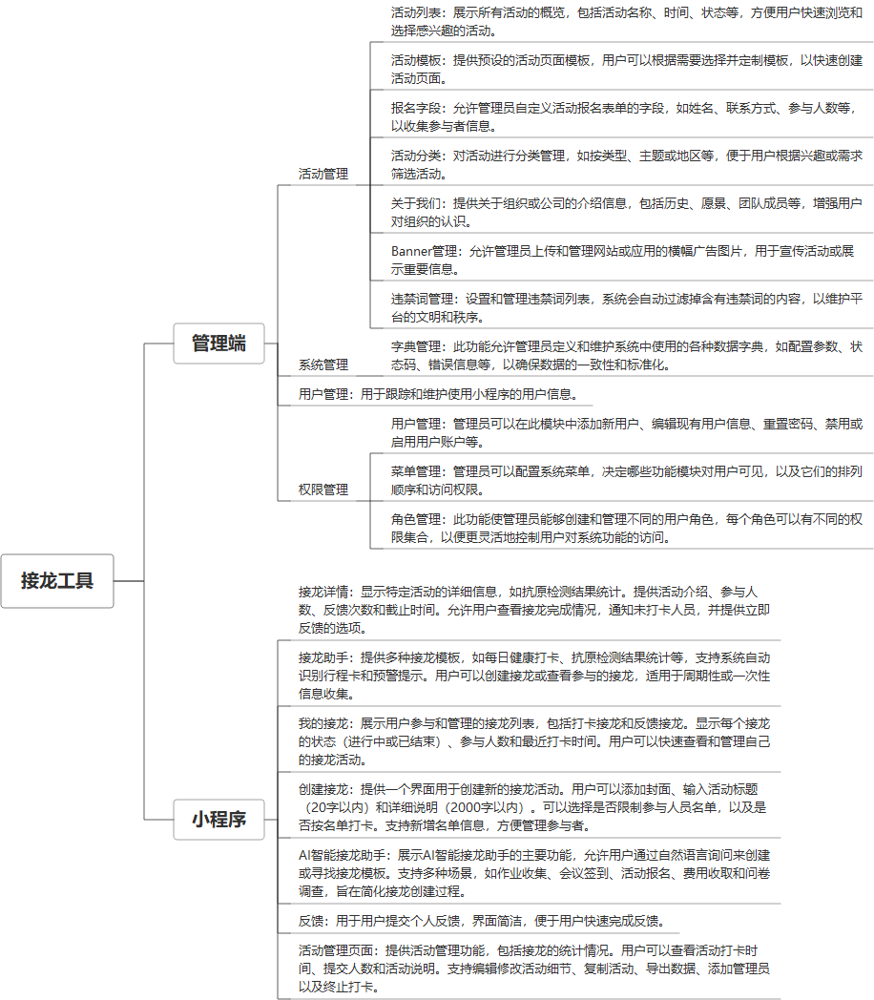

 

    
 

公司拥有上百套具有自主知识产权的软件系统，详情请查看码云首页或公司官网

 
<h1>接龙工具</h1>

<a href="https://www.haishi.net.cn/">公司官网</a> ｜ <a href="https://www.haishi.net.cn/">在线体验</a>

 

## 系统介绍

群接龙主要用于微信好友和微信群之间各种接龙场景，如：活动报名、团购、收集信息、活动互动的、社群通知等。支持模板市场、AI生成模板、数据管理、数据导出功能。
群接龙主要用于微信好友和微信群之间各种接龙场景，如：活动报名、团购、收集信息、活动互动的、社群通知等。支持模板市场、AI生成模板、数据管理、数据导出功能。
本项目名称为接龙工具丨打卡报名通知统计，是一款用于活动管理的工具，提供活动创建、管理、数据导出等功能，方便用户进行活动的组织和管理。该工具主要面向需要进行活动报名、打卡、通知等管理的用户，例如社团、班级、企业等。本项目提供管理端，用户可以通过管理端进行活动模板创建、活动管理、数据导出等操作。
                

## 系统功能介绍

### 系统包含终端说明

管理端（WEB）

| 序号 | 模块 | 模块说明 |
| --- | --- | --- |
| 1 | QHY-QJL-XCX-SERVER | 服务端 |
| 2 | QHY-QJL-XCX-MP | 小程序 |
| 3 | QHY-QJL-XCX-MANAGE | 管理端 |

### 系统功能结构

### 系统功能说明

主要功能：
- 活动模板创建：用户可以创建活动模板，方便后续活动的快速创建。
- 活动管理：用户可以对已创建的活动进行管理，包括编辑活动、复制活动、删除活动、终止活动等。
- 数据导出：用户可以将活动数据导出，方便进行数据分析和统计。
- 添加管理员：用户可以添加管理员，共同管理活动。
- 编辑活动：用户可以编辑活动的详细信息。
- 复制活动：用户可以复制已有的活动，快速创建新的活动。
- 删除活动：用户可以删除不再需要的活动。
- 终止活动：用户可以终止正在进行的活动。

## 系统主要界面

## 系统技术说明

### 代码模块说明

| 序号 | 目录 | 目录说明 |
| --- | --- | --- |
| 1 | QHY-QJL-XCX-SERVER/px-activity-biz | -- |

### 系统技术选型

#### 开发语言/框架

JAVA（JDK1.8）
前端框架：VUE2

#### 服务中间件

Nginx
Tomcat

#### 数据库

MySQL（5.7+）
Redis

#### 其他说明

无

## 系统演示/商用

请扫码添加客服微信获取演示地址和系统详细资料。

如果您想基于接龙工具进行商业化交付或定制开发服务，我们提供有偿的技术服务支持，合作模式不限，欢迎沟通！

公司官网地址： <a href="https://www.haishi.net.cn/">https://www.haishi.net.cn</a>

联系客服获取专业回答。

## 使用须知

1、 本项目商用必须获得版权所有者的授权。

2、 未经允许本项目代码不允许二次出售。

